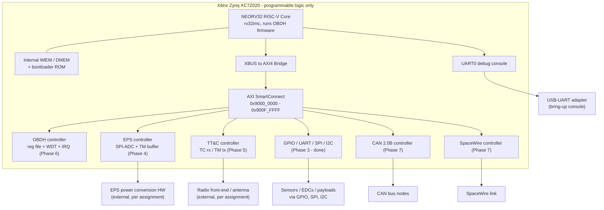

# SAToC Architecture Proposal

Assignment task: *"Propose a Satellite-on-a-Chip architecture showing
how the OBDH, TT&C, EPS, memory resources, and the RISC-V processor are
integrated within the FPGA"* and *"Develop a detailed block diagram of the
proposed architecture."*

## 1. Platform

**Xilinx Zynq XC7Z020 (Digilent PYNQ-Z2)**, available at both LNMIIT and
SpaceLab (not confirmed), which fits the assignment's preference for a
shared development platform. The design only uses the **programmable logic
(PL)**. The Zynq's hardened ARM processing system (PS7) is deliberately left
unused, so the entire OBC ends up being a soft RISC-V core implemented in
fabric. That's really what makes this a genuine *Satellite-on-a-Chip* rather
than a Zynq PS/PL hybrid, and it also keeps the architecture portable to a
non-Zynq, PL-only FPGA down the line if that's ever needed.

## 2. Integration model: one CPU, one bus, one address map

All three subsystems, OBDH, EPS, and TT&C, along with the communication
controllers (GPIO, UART, SPI, I2C, CAN, SpaceWire) sit as memory-mapped
AXI4-Lite peripherals on a single AXI SmartConnect interconnect, driven by
one AXI4 master: the NEORV32 RISC-V core. There's no separate microcontroller
per subsystem by design. One CPU running the OBDH firmware acts as the single
point of orchestration, which is basically how the real GOLDS-UFSC satellite
already works. The CDR documentation for GOLDS-UFSC describes this same
pattern in PCB form, with separate EPS, OBDH, and TTC modules exchanging
housekeeping data over SPI/I2C/UART links. This project's job is to collapse
that same functional split onto one chip, not to invent a new architecture
from scratch.

Memory resources are split into two tiers:

- **Internal to the CPU** (not on the AXI bus at all): NEORV32's own IMEM
  (16 KiB instructions), DMEM (8 KiB data), and bootloader ROM, all reached
  over NEORV32's internal bus. This is where the OBDH firmware itself lives
  and runs from.
- **On the AXI bus**: every subsystem's register file (status, control,
  telemetry buffers). Not bulk storage, just the memory-mapped interface
  each subsystem controller exposes to the CPU.

## 3. Block diagram

## 4. Data flow (firmware's view)

This mirrors the GOLDS-UFSC CDR's documented OBDH/EPS/TTC operational cycle,
just translated from "three PCB modules talking over UART/SPI/I2C" into
"three memory-mapped register blocks on one AXI bus":

1. **Boot**: NEORV32 boots from its internal bootloader ROM and runs the OBDH
   housekeeping loop from IMEM/DMEM.
2. **EPS polling**: OBDH firmware reads the EPS controller's registers
   (Phase 4) at a fixed housekeeping rate, voltage, current, status, the same
   role the real EPS 2.0 module's periodic report plays in the CDR design.
3. **TT&C servicing**: OBDH firmware checks the TT&C controller (Phase 5) for
   an incoming telecommand each cycle, and periodically builds a telemetry
   frame from EPS and OBDH housekeeping data for the TT&C controller to
   transmit. This matches the CDR's "TTC receives a simplified version, OBDH
   receives a complete version" split, just implemented as two register views
   instead of two physical links.
4. **Watchdog**: OBDH controller's hardware watchdog (Phase 6) gets kicked
   once per loop; a missed kick resets the CPU, standing in for the same
   reliability role the CDR's boot/reset sequencing describes.
5. **Peripheral I/O**: GPIO/UART/SPI/I2C (Phase 3, complete) and CAN/SpaceWire
   (Phase 7) are available to any subsystem controller or directly to OBDH
   firmware for sensor, actuator, or payload access, exactly what the
   assignment's "auxiliary protocols for peripherals and sensors"
   requirement asks for.

## 5. Address map

Full detail lives in `satoc_axi_memory_map.md` (a Phase 2 deliverable):

| Base | Subsystem |
|---|---|
| 0x9000_0000 | OBDH |
| 0x9001_0000 | EPS |
| 0x9002_0000 | TT&C |
| 0x9003_0000-0x9006_0000 | GPIO / UART / SPI / I2C |
| 0x9007_0000 | CAN |
| 0x9008_0000 | SpaceWire |

## 6. Why this satisfies the assignment's architecture requirement

- **Single FPGA integration** of OBDH, TT&C, EPS, RISC-V, and memory: shown
  above, all on one AXI bus inside one XC7Z020.
- **External-hardware boundary respected**: EPS power conversion and RF/antenna
  stages are explicitly kept off-chip (dashed boxes), which matches the
  assignment's note that some components can't be implemented directly in
  FPGA logic.
- **Grounded in SpaceLab heritage**: the OBDH/EPS/TT&C data-flow roles come
  directly from the GOLDS-UFSC CDR's documented module behavior rather than
  being invented. It's a single-chip re-implementation of a design SpaceLab
  already flies, not a from-scratch architecture.
- **Traceable to the phase-by-phase build**: every box in the diagram maps to
  a specific phase already completed (1-3) or planned (4-8) in this project,
  so the architecture document and the actual repository stay in sync.
